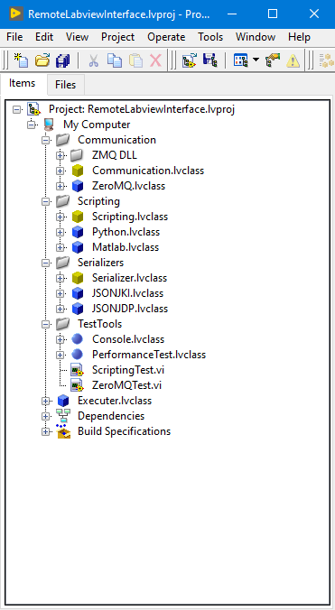

<h3 align="center">Remote LabVIEW Interface</h3>

  

    Bi-directional strictly typed labVIEW interface for other programming languages
  

<!-- TABLE OF CONTENTS -->

  
Table of Contents

  <ol>
    <li>
      <a href="#about-the-project">About The Project</a>
      <ul>
        <li><a href="#built-with">Built with and for</a></li>
      </ul>
    </li>
    <li>
      <a href="#getting-started">Getting Started</a>
    </li>
    <li><a href="#usage">Usage</a></li>
    <li><a href="#contributing">Contributing</a></li>
    <li><a href="#license">License</a></li>
    <li><a href="#contact">Contact</a></li>
    <li><a href="#acknowledgments">Acknowledgments</a></li>
  </ol>

<!-- ABOUT THE PROJECT -->
## About The Project

Project for connecting Python or matlab to LabVIEW

This code can script a bi-directional strict interface between LabVIEW and the external language.
With this you can provide users of your application with easy to use code in their own language.

(<a href="#readme-top">back to top</a>)

### Built with and for

* [LabVIEW](ni.com)

(<a href="#readme-top">back to top</a>)

<!-- GETTING STARTED -->
## Getting Started

This project is built for LabVIEW 2018 and above.
Python Version 3 and above

### Dependencies LabVIEW

* JKI StateMachine
* ZeroMQ
* JKI JSON
* JDP JSON

### Dependencies Python

* json
* zmq

(<a href="#readme-top">back to top</a>)

<!-- USAGE EXAMPLES -->
## Usage

* Open the .lvproject that is in the repo
* Run the ZeroMQTest.vi
* Open the example_helloworld.py in the scripts folder
* Run the code and enjoy

(<a href="#readme-top">back to top</a>)

<!-- CONTRIBUTING -->
## Contributing

Contributions are what make the open source community such an amazing place to learn, inspire, and create. Any contributions you make are **greatly appreciated**.
I will try looking out for the issues created and answer any questions, but also feel free to reach out to me trough the contact information below.

If you have a suggestion that would make this better, please simply open an issue with the tag "enhancement".
Don't forget to give the project a star! Thanks again!

(<a href="#readme-top">back to top</a>)

<!-- LICENSE -->
## License

Distributed under the MIT License. See `LICENSE.txt` for more information.

(<a href="#readme-top">back to top</a>)

<!-- CONTACT -->
## Contact

Maarten Scherjon - [@LinkedIN](https://www.linkedin.com/in/maarten-scherjon-853b65ab/) - maarten (at) vi-tech.nl

VI-Technologies - [@VI-Technologies](https://www.vi-tech.nl/nl)

(<a href="#readme-top">back to top</a>)

<!-- ACKNOWLEDGMENTS -->
## Acknowledgments

* [Patriek bruins](https://www.linkedin.com/in/patriek-bruins-94b4b410/) for the original idea and code for this project

(<a href="#readme-top">back to top</a>)

<!-- MARKDOWN LINKS & IMAGES -->
<!-- https://www.markdownguide.org/basic-syntax/#reference-style-links -->
